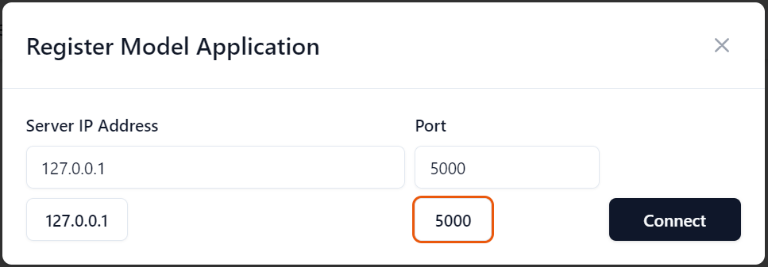
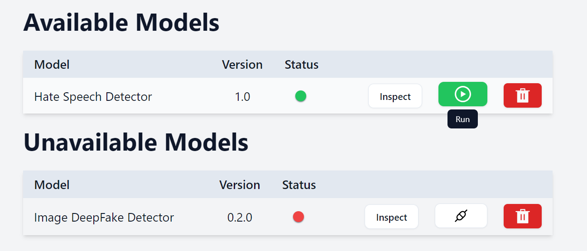
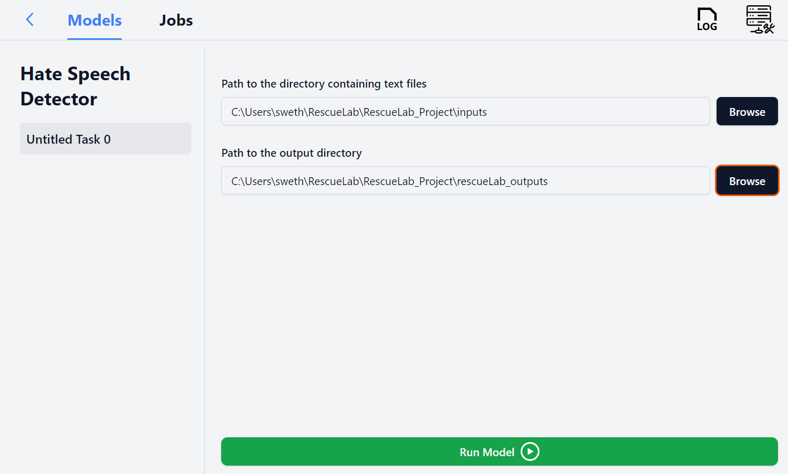
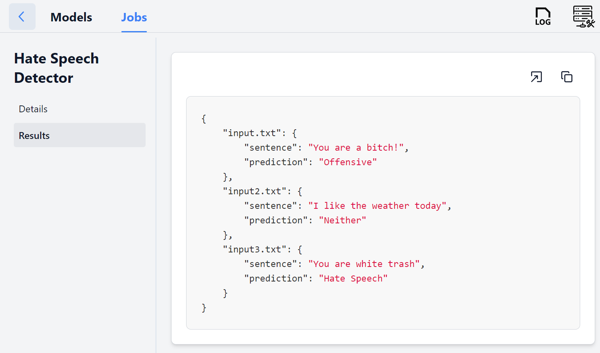

# Hate Speech Detection Model with ONNX and Flask-ML

This repository demonstrates how to create, convert, and deploy a Hate Speech Detection model using ONNX and Flask-ML. The model is designed to be compatible with the **RescueBox Desktop** application.

## Overview

1. **Model Creation**: A Hate Speech Detection model is trained and saved as `hate_speech_model.keras`.
2. **ONNX Conversion**: The model is converted to the ONNX format (`hate_speech_model.onnx`) for optimized inference.
3. **Flask-ML Server**: The ONNX model is deployed using a Flask-based ML server, making it accessible for predictions.
4. **Command Line Interface (CLI)**: A CLI is provided to test the model on text files and generate predictions in JSON format.

## Getting Started

## Prerequisites

- Python 3.12.4
- Pip (Python package manager)

## Installation

1. **Clone the Repository**:

   ```bash
   git clone https://github.com/your-username/hate-speech-detection.git
   cd hate-speech-detection
   ```

2. **Install Dependencies:**
   Install the required Python packages using the following command:

   ```bash
   pip install -r requirements.txt
   ```

3. **Download the ONNX Model:**
   Download the `hate_speech_model.onnx` file in the project directory. Or you can generate it using the provided scripts.

   Model Training and Conversion
   [Dataset](https://www.kaggle.com/datasets/mrmorj/hate-speech-and-offensive-language-dataset)

   Train the Model:

   Open and run the `HateSpeech.ipynb` Jupyter notebook to train the model which automatically saves the model as `hate_speech_model.keras`.

   Convert to ONNX:
   Use the onnxconversion.py script to convert the trained model to ONNX format:

   ```bash
   python onnxconversion.py
   ```

   This will generate the `hate_speech_model.onnx` file.

4. **Running the Flask-ML Server**
   Start the Flask-ML server to serve the model for predictions:

   ```bash
   python server.py
   ```

   The server will start running.

   ## Download and run RescueBox Desktop from the following link: [Rescue Box Desktop](https://github.com/UMass-Rescue/RescueBox-Desktop/releases)

   Open the RescueBox Desktop application and register the model

   Open the RescueBox Desktop application and register the model

   

   Run the model

   
   

   View the results

   

5. **Using the Command Line Interface (CLI)**
   The CLI allows you to test the model on text files and save the predictions in JSON format.

   Prepare Input Files:
   Place the txt files containing sentences for prediction in an inputs folder

   Run the CLI:
   Use the following command to generate predictions:

   ```bash
   python run_cli.py --input_dir inputs --output_dir outputs
   ```

   --input_dir: Directory containing the input text files.
   --output_dir: Directory where the JSON file with predictions will be saved.

   ## Project Structure

   hate-speech-detection/
   ├── HateSpeech.ipynb # Jupyter notebook for model training
   ├── onnxconversion.py # Script to convert the model to ONNX
   ├── hate_speech_model.keras # model
   ├── hate_speech_model.onnx # ONNX model file
   ├── server.py # Flask-ML server script
   ├── run_cli.py # Command line interface for predictions
   ├── requirements.txt # List of dependencies
   ├── inputs/ # Directory for input text files
   ├── tokenizer.pkl # Tokenizer
   └── outputs/ # Directory for output JSON files
